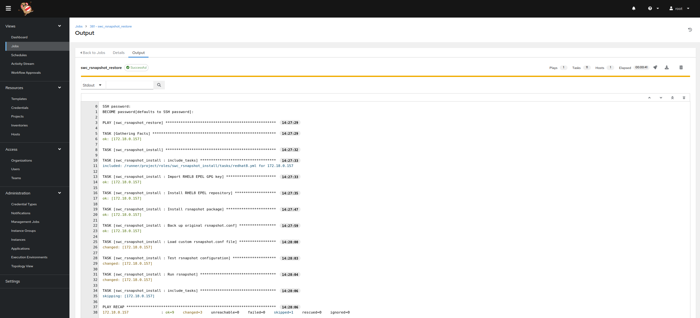
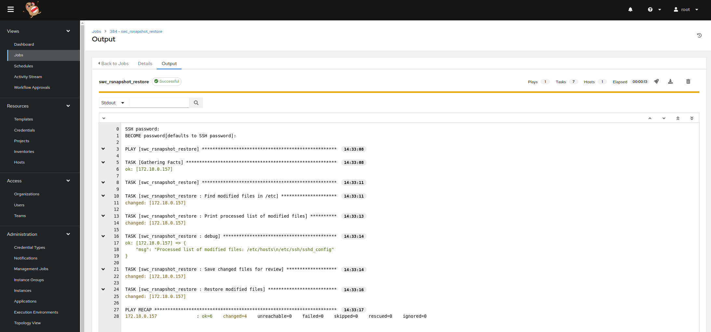
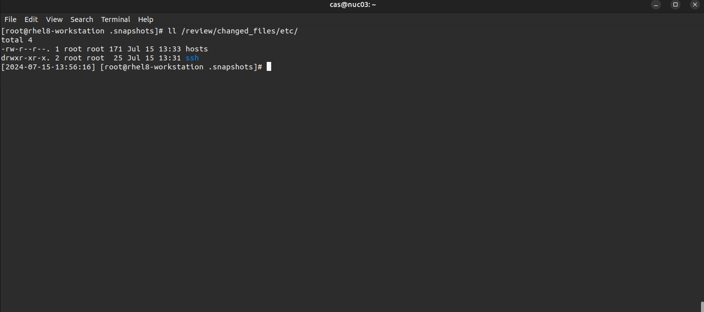

# swc_rsnapshot
* This repository contains playbooks to install rsnapshot on RHEL8 and backup a known good configuration of /etc using rsnapshot which is located at /.snapshots/alpha.0/localhost/etc/, it also will restore files changed post alpha.0 and restore any modified files and save off the files that were changed at /review/changed_files. For any additional details or inquiries, please contact us at christopher.sargent@sargentwalker.io.

* [Rsnapshot](https://github.com/rsnapshot/rsnapshot)

# swc_rsnapshot_installer 
* Run swc_rsnapshot_installer role to create a backup of known good /etc. Note that is stored at /.snapshots/alpha.0/localhost/etc/.
* Ideal use case is on a system whos /etc config shows desirably on a nessus scan. Then run rsnapshot_installer to create the alpha.0 backup as a known good reference.

1. git clone git@github.com:ChristopherSargent/swc_rsnapshot.git
2. cd swc_rsnapshot
3. vim swc_rsnapshot.yml
```
---
  - name: swc_rsnapshot_restore
    hosts: all
    gather_facts: yes
    become_user: root
    tasks:
    - name: swc_rsnapshot_install
      include_role:
        name: swc_rsnapshot_install

#   - name: swc_rsnapshot_restore
#      include_role:
#        name: swc_rsnapshot_restore
```
4. Configure AAP/AWX for inventory, credentials, project and template
5. Launch swc_rsnapshot to install epel and rsnapshot and create a backup of known good /etc located at /.snapshots/alpha.0/localhost/etc/



6. modify /etc/ssh/sshd_config and /etc/hosts
* for testing purposes

# swc_rsnapshot_restore
* Note that the file that was modified from alpha.0 will be stored here for review /review/changed_files
7. vim swc_rsnapshot.yml
```
---
  - name: swc_rsnapshot_restore
    hosts: all
    gather_facts: yes
    become_user: root
    tasks:
#    - name: swc_rsnapshot_install
#      include_role:
#        name: swc_rsnapshot_install

   - name: swc_rsnapshot_restore
      include_role:
        name: swc_rsnapshot_restore
```
8. Launch swc_rsnapshot to locate changed files, restore them and create a directory of the files that were modified post alpha.0
* note debug prints files that were modified.





9. verify your sshd_config and hosts file changes have been restored
